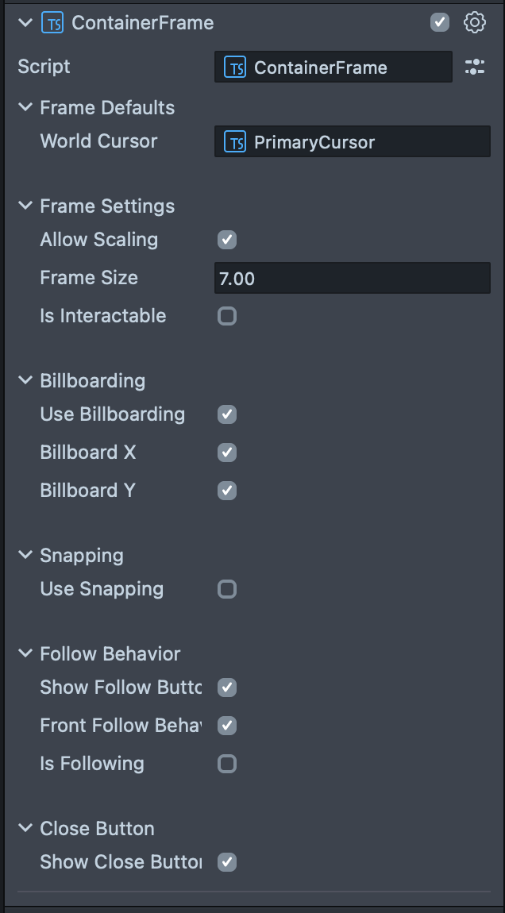

# :framed_picture: Container Frame :framed_picture:

## A window for your AR Content


### Setup

- Create a Scene Object
- Add the ContainerFrame typsescript component to the new object
- Set the target content as the child of the new object created above
- Adjust the frameSize attribute for the desired appearance
- Adjust the border attribute for desired experience
- Check the UI and API below for additional functionality

---

### Usage

The frame requires a specific hierarchy setup in your scene.

Create a SceneObject that is a parent to the content you want to contain in the frame:

```
\__> Parent (add the ContainerFrame component here)
   \__> Content (can be multiple items)
```

This will result in the ContainerFrame generating the following hierarchy at runtine:

```
\__> Parent (with ContainerFrame component)
   \__> ContainerInner (automatically created by ContainerFrame)
      \__> Content (can be multiple items)
   \__> Frame SceneObject (automatically created by ContainerFrame)
      \__> Frame UI SceneObjects...
      \__> ...
```

---

### UI



---

### API

ContainerFrame.autoShowHide <br>&nbsp;&nbsp;&nbsp; `boolean` if true, ContainerFrame will auto show and hide on hover
<br><br>ContainerFrame.frameSize <br>&nbsp;&nbsp;&nbsp; `vec2` size of the frame
<br><br>ContainerFrame.border <br>&nbsp;&nbsp;&nbsp; `number` thickness of border
<br><br>ContainerFrame.autoScaleContent <br>&nbsp;&nbsp;&nbsp; `boolean` if true, ContainerFrame content will scale along with frame when scaled
<br><br>ContainerFrame.addCloseButtonOnTrigger( `function` ) <br>&nbsp;&nbsp;&nbsp; called when close button is triggered
<br><br>ContainerFrame.addFollowButtonOnTrigger( `function` ) <br>&nbsp;&nbsp;&nbsp; called when follow button is triggered
<br><br>ContainerFrame.onScalingUpdateEvent <br>&nbsp;&nbsp;&nbsp; `publicApi` event api for user scaling update
<br><br>ContainerFrame.onScalingStartEvent <br>&nbsp;&nbsp;&nbsp; `publicApi` event api for user scaling start
<br><br>ContainerFrame.onScalingEndEvent <br>&nbsp;&nbsp;&nbsp; `publicApi` event api for user scaling end
<br><br>ContainerFrame.isVisible <br>&nbsp;&nbsp;&nbsp; `boolean` readOnly boolean for if the ContainerFrame isVisible
<br><br>ContainerFrame.onSnappingComplete <br>&nbsp;&nbsp;&nbsp; `publicApi` event api for snapping tween completed
<br><br>ContainerFrame.frontFollowBehavior <br>&nbsp;&nbsp;&nbsp; `FrontFollowBehavior` reference to default FrontFollowBehavior packaged with ContainerFrame
<br><br>ContainerFrame.getInteractable() <br>&nbsp;&nbsp;&nbsp; `returns Interactable` gets Interactable for the frame itself
<br><br>ContainerFrame.getInteractableManipulation() <br>&nbsp;&nbsp;&nbsp; `returns InteractableManipulation` gets InteractableManipulation for the frame itself
<br><br>ContainerFrame.setIsContentInteractable( `boolean` ) <br>&nbsp;&nbsp;&nbsp; `void` updates input handler to handle interactions as if content is interactable
<br><br>ContainerFrame.setIsSnappable( `boolean` ) <br>&nbsp;&nbsp;&nbsp; enable or disable SnappableBehavior
<br><br>ContainerFrame.setAllowScaling( `boolean` ) <br>&nbsp;&nbsp;&nbsp; enable or disable user scaling
<br><br>ContainerFrame.setUseFollow( `boolean` ) <br>&nbsp;&nbsp;&nbsp; attach default FrontFollowBehavior to FollowButton
<br><br>ContainerFrame.setIsFollowing( `boolean` ) <br>&nbsp;&nbsp;&nbsp; enable or disable frontFollowBehavior ( the following itself! )
<br><br>ContainerFrame.isSnappingTweening() <br>&nbsp;&nbsp;&nbsp; `boolean` returns whether the ContainerFrame is currently tweening
<br><br>ContainerFrame.isSnappingActive() <br>&nbsp;&nbsp;&nbsp; `boolean` returns whether the ContainerFrame is actively looking for anotehr snappable frame
<br><br>ContainerFrame.getTargetObject() <br>&nbsp;&nbsp;&nbsp; `SceneObject` returns innerContainer which contains all the provided content
<br><br>ContainerFrame.getFrameObject() <br>&nbsp;&nbsp;&nbsp; `SceneObject` returns the FramePrefab object itself
<br><br>ContainerFrame.setHoverInteractableOpacity( `number` ) <br>&nbsp;&nbsp;&nbsp; `0-1` set the opacity of the frame when hovering interactive children
<br><br>ContainerFrame.setMinimumScale( `vec2` ) <br>&nbsp;&nbsp;&nbsp; set the minimum scale of the frame
<br><br>ContainerFrame.setMaximumScale( `vec2` ) <br>&nbsp;&nbsp;&nbsp; set the maximum scale of the frame
<br><br>ContainerFrame.enableInteractables( `boolean` ) <br>&nbsp;&nbsp;&nbsp; enable or disable the interactable elements of the frame itself ( frame, buttons )
<br><br>ContainerFrame.worldPosition <br>&nbsp;&nbsp;&nbsp; get or set the current worldPosition of the parentTransform
<br><br>ContainerFrame.localPosition <br>&nbsp;&nbsp;&nbsp; get or set the current localPosition of the parentTransform
<br><br>ContainerFrame.worldRotation <br>&nbsp;&nbsp;&nbsp; get or set the current worldRotation of the parentTransform
<br><br>ContainerFrame.localRotation <br>&nbsp;&nbsp;&nbsp; get or set the current localRotation of the parentTransform
<br><br>ContainerFrame.worldScale <br>&nbsp;&nbsp;&nbsp; get or set the current worldScale of the parentTransform
<br><br>ContainerFrame.localScale <br>&nbsp;&nbsp;&nbsp; get or set the current localScale of the parentTransform
<br><br>ContainerFrame.renderOrder <br>&nbsp;&nbsp;&nbsp; get or set the renderOrder for the frame itself
<br><br>ContainerFrame.destroy() <br>&nbsp;&nbsp;&nbsp; function for destroying and disposing of the frame and its components
<br><br>ContainerFrame.getFollowButton() <br>&nbsp;&nbsp;&nbsp; returns follow button SceneObject
<br><br>ContainerFrame.getCloseButton() <br>&nbsp;&nbsp;&nbsp; returns close button SceneObject
<br><br>ContainerFrame.enableFollowButton( `boolean` ) <br>&nbsp;&nbsp;&nbsp; enable or disable the follow button SceneObject
<br><br>ContainerFrame.enableCloseButton( `boolean` ) <br>&nbsp;&nbsp;&nbsp; enable or disable the close button SceneObject
<br><br>ContainerFrame.setButtonsOnLeft( `boolean` ) <br>&nbsp;&nbsp;&nbsp; enable or disable positioning both buttons to left of frame
<br><br>ContainerFrame.setButtonsAbove( `boolean` ) <br>&nbsp;&nbsp;&nbsp; enable or disable positioning both buttons to above the frame
<br><br>ContainerFrame.getParentTransform() <br>&nbsp;&nbsp;&nbsp; returns container parent Transform
<br><br>ContainerFrame.showVisual() <br>&nbsp;&nbsp;&nbsp; tween up the opacity of the frame and its elements to 1
<br><br>ContainerFrame.hideVisual() <br>&nbsp;&nbsp;&nbsp; tween down the opacity of the frame and its elements to 0
<br><br>ContainerFrame.opacity <br>&nbsp;&nbsp;&nbsp; get or set the current opacity of the frame and its elements
